# Swagger UI Themes

A comprehensive theming library for Swagger UI v3+ with 14 beautiful themes and an intuitive theme selector. This WebJar package provides easy integration of themed Swagger UI into Spring Boot applications.

[](https://jitpack.io/#KushalPatel89/swagger-v3-themes)
[](https://github.com/KushalPatel89/swagger-v3-themes/releases)
[](https://opensource.org/licenses/MIT)

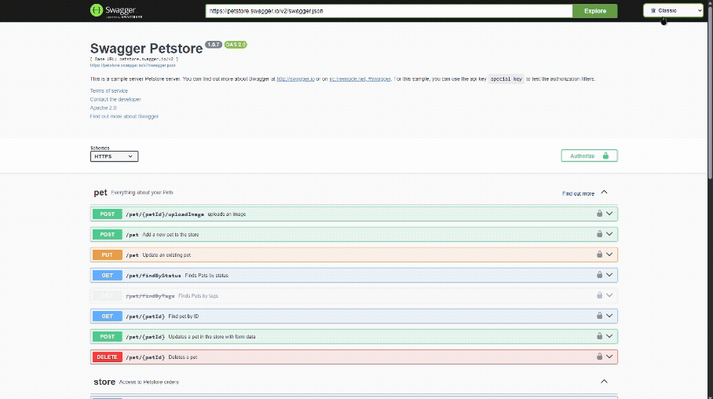

## 🎨 Features

- **14 Beautiful Themes** - From classic to modern, light to dark
- **Theme Selector** - Easy dropdown to switch between themes
- **Auto Theme** - Automatically switches between light/dark based on system preference
- **Keyboard Shortcuts** - Quick theme switching with keyboard shortcuts
- **Spring Boot Ready** - Drop-in replacement for default Swagger UI
- **Persistent Selection** - Remembers user's theme preference
- **Responsive Design** - Works on desktop and mobile
- **WebJar Format** - Standard WebJar packaging for easy dependency management

## 📦 Installation

### Gradle
```groovy
repositories {
    mavenCentral()
    maven { url 'https://jitpack.io' }
}

dependencies {
    implementation 'com.github.KushalPatel89:swagger-v3-themes:1.0.0'
}
```
### Maven
```xml
<repositories>
    <repository>
        <id>jitpack.io</id>
        <url>https://jitpack.io</url>
    </repository>
</repositories>

<dependency>
    <groupId>com.github.KushalPatel89</groupId>
    <artifactId>swagger-v3-themes</artifactId>
    <version>1.0.0</version>
</dependency>
```
## 🚀 Usage

### Spring Boot (Recommended)
Simply add the dependency to your project. The library automatically overrides the default Swagger UI with the themed version.
```java
@SpringBootApplication
public class YourApplication {
    public static void main(String[] args) {
        SpringApplication.run(YourApplication.class, args);
    }
}
```
### Manual Configuration (Advanced)
If you need custom resource handling:
```java
@Configuration
public class SwaggerConfig {

    @Bean
    public WebMvcConfigurer swaggerThemeConfigurer() {
        return new WebMvcConfigurer() {
            @Override
            public void addResourceHandlers(ResourceHandlerRegistry registry) {
                registry.addResourceHandler("/webjars/swagger-ui/**")
                    .addResourceLocations("classpath:/META-INF/resources/webjars/swagger-ui/");
            }
        };
    }
}
```
### OpenAPI 3 Configuration Example
```java
@Configuration
@OpenAPIDefinition(
    info = @Info(
        title = "Your API",
        version = "1.0.0",
        description = "API with themed Swagger UI"
    )
)
public class OpenApiConfig {
    // Your OpenAPI configuration
}
```
## 🎨 Available Themes

| Theme | Description | Category |
|-------|-------------|----------|
| 🌓 Auto | System preference (light/dark) | System |
| 🏛️ Classic | Original Swagger UI styling | Light |
| 🌙 Dark | Clean dark theme | Dark |
| 🌚 Dark Monokai | Dark with Monokai colors | Dark |
| 🧛 Dracula | Popular Dracula theme | Dark |
| 💙 Feeling Blue | Blue-themed interface | Colored |
| 📱 Flattop | Modern flat design | Modern |
| 🏔️ Gruvbox | Retro groove colors | Dark |
| 🎨 Material | Material Design inspired | Modern |
| 👨‍💻 Monokai | Classic developer theme | Dark |
| 🔇 Muted | Subtle, muted colors | Subtle |
| 📰 Newspaper | Print-style interface | Classic |
| 🏔️ Nord Dark | Nord color scheme | Dark |
| ⚡ One Dark | Atom's One Dark theme | Dark |
| 📝 Outline | Minimal outline style | Minimal |

## ⌨️ Keyboard Shortcuts

- `Ctrl/Cmd + Shift + T` - Cycle through all themes
- `Ctrl/Cmd + Shift + D` - Cycle through dark themes only

## 🛠️ JavaScript API
```javascript
// Switch to a specific theme
toggleTheme('dracula');

// Get available themes
const themes = getAvailableThemes();

// Get themes by category
const darkThemes = getThemesByCategory('dark');

// Apply random theme
randomTheme();

// Preview theme for 3 seconds
previewTheme('material', 3000);
```
## 📸 Theme Showcase

### Light Themes
| Theme | Preview |
|-------|---------|
| Classic | 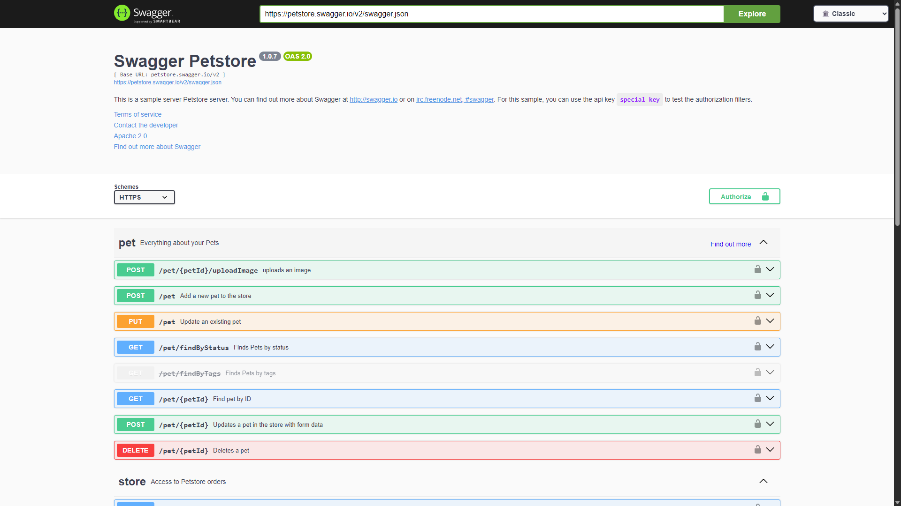 |
| Feeling Blue | 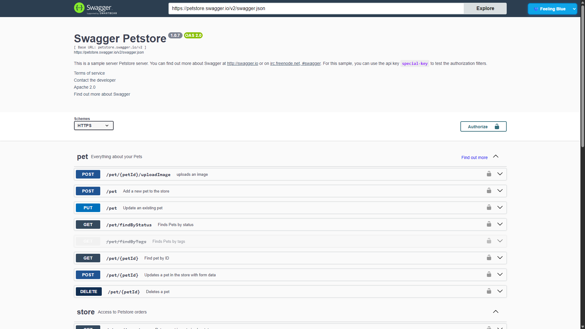 |
| Flattop | 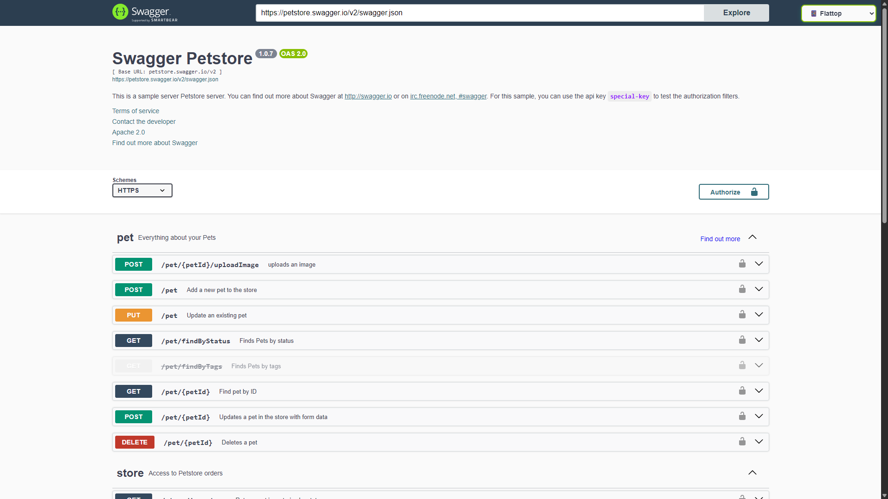 |
| Material | 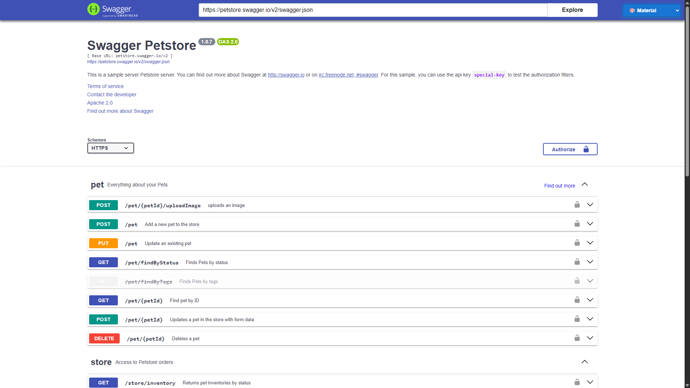 |
| Muted | 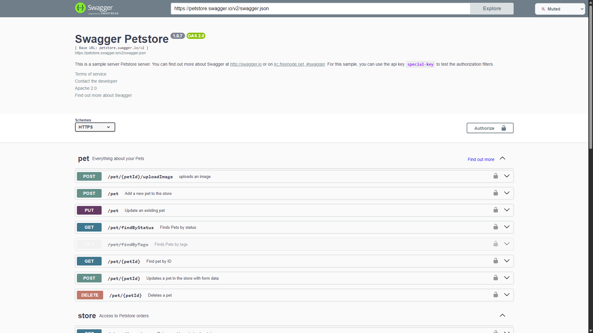 |
| Newspaper | 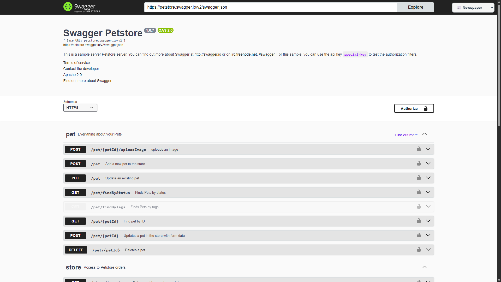 |
| Outline | 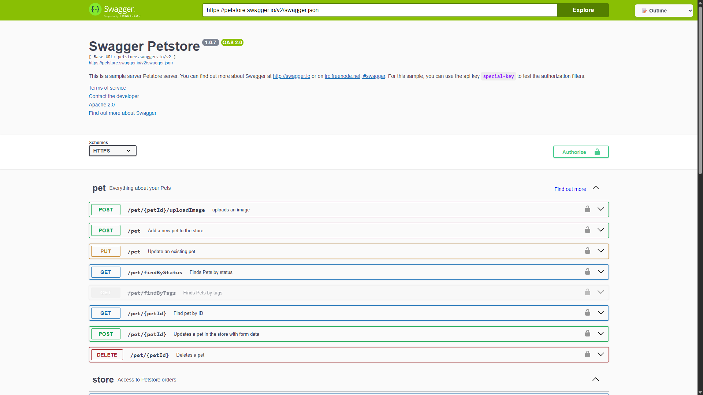 |

### Dark Themes
| Theme | Preview |
|-------|---------|
| Dark | 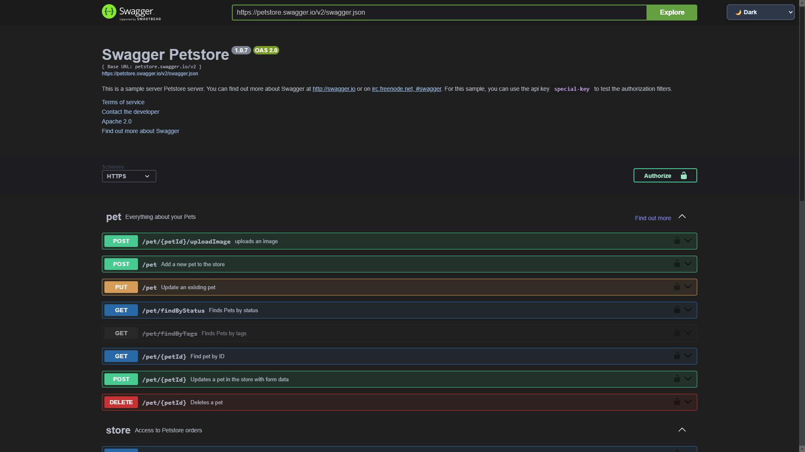 |
| Dark Monokai | 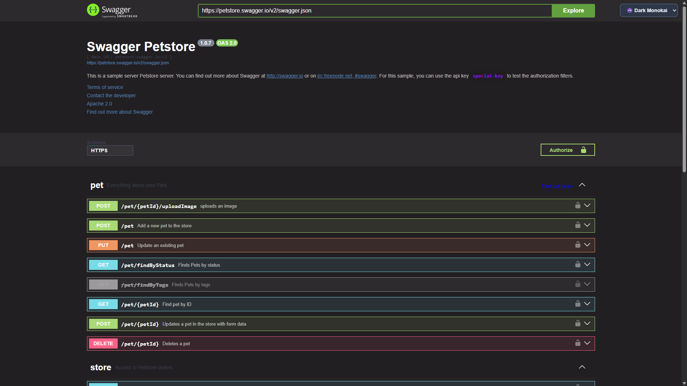 |
| Dracula | 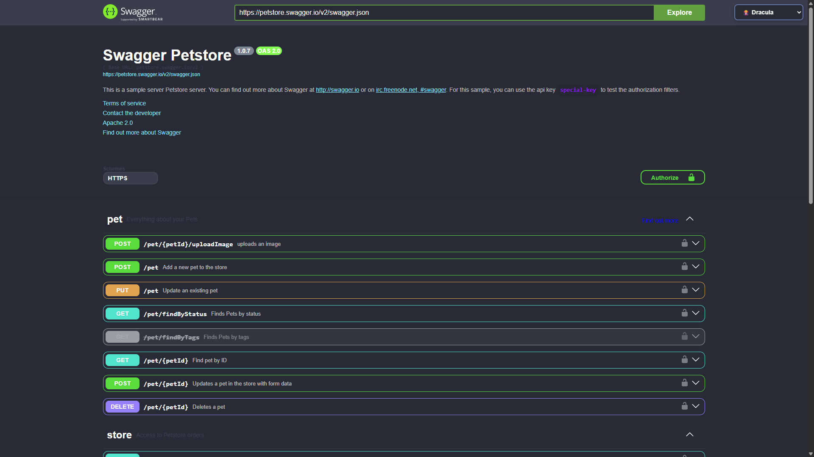 |
| Gruvbox | 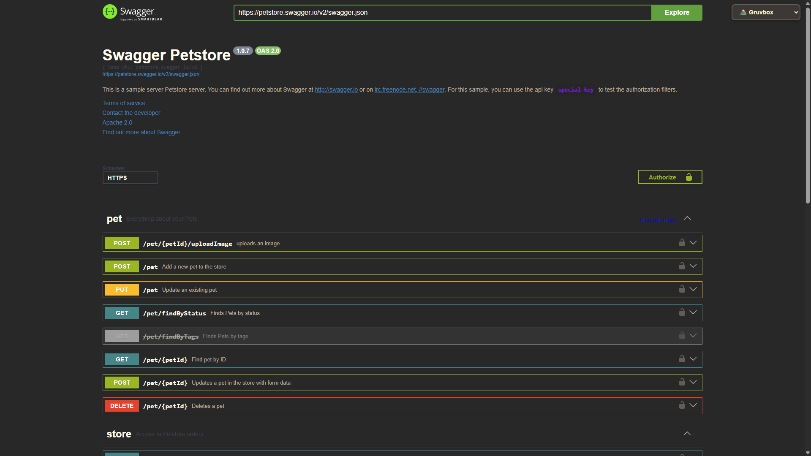 |
| Monokai | 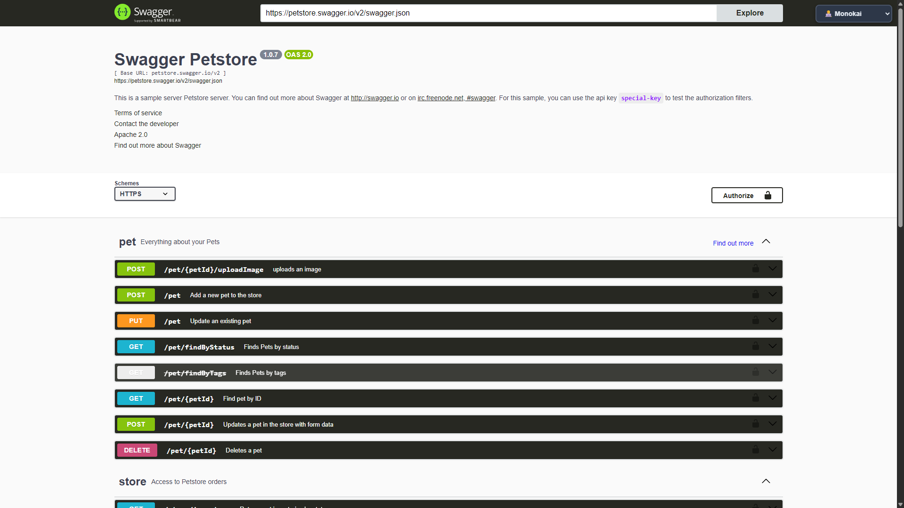 |
| Nord Dark | 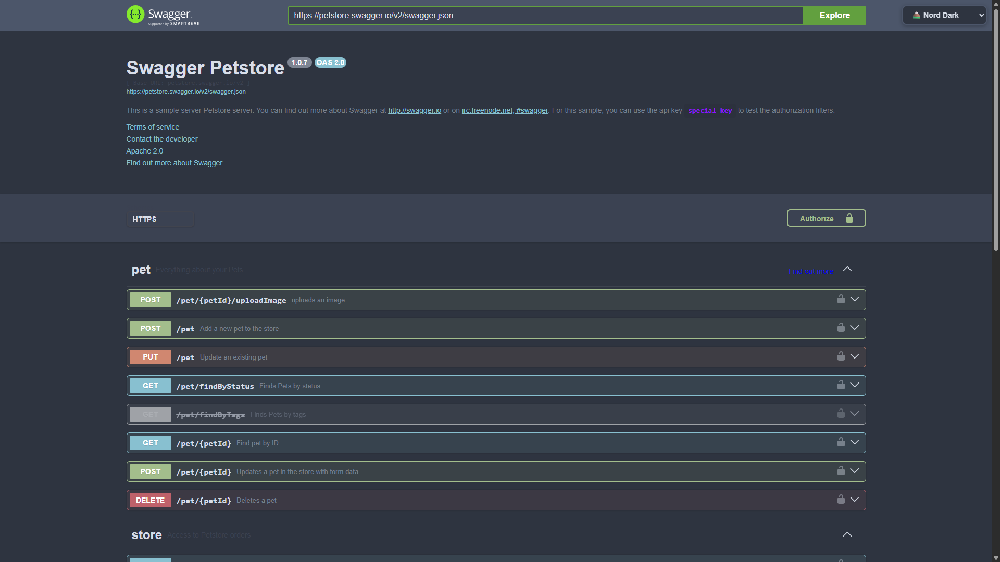 |
| One Dark | 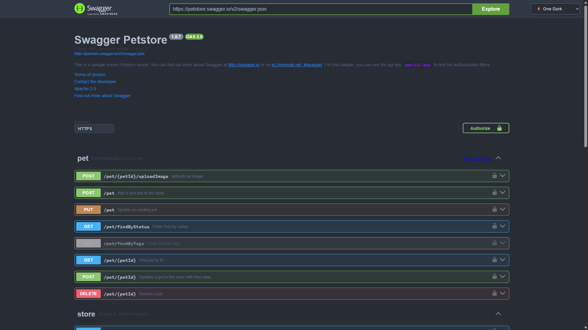 |

## 🎯 Compatibility

- **Swagger UI**: v3.0.0+
- **Spring Boot**: 2.0.0+
- **Java**: 8+
- **Browsers**: All modern browsers
- **OpenAPI**: 3.0+

## 📝 License

This project is licensed under the MIT License - see the [LICENSE](LICENSE) file for details.

## 🙏 Credits and Attribution

### Swagger UI
This library builds upon the excellent [Swagger UI](https://github.com/swagger-api/swagger-ui) project:
- **Repository**: https://github.com/swagger-api/swagger-ui
- **License**: Apache 2.0
- **Description**: Swagger UI is a collection of HTML, JavaScript, and CSS assets that dynamically generate beautiful documentation from a Swagger-compliant API

### Theme Styles
The CSS themes used in this library are from the [swagger-themes](https://github.com/ilyamixaltik/swagger-themes) repository:
- **Repository**: https://github.com/ilyamixaltik/swagger-themes
- **Author**: [ilyamixaltik](https://github.com/ilyamixaltik)
- **License**: MIT
- **Description**: Beautiful themes for Swagger UI

### This Library
This WebJar provides:
- WebJar packaging for easy dependency management
- Theme selector interface with enhanced UX
- JavaScript functionality for theme switching
- Spring Boot auto-configuration
- Keyboard shortcuts and accessibility features

## 🤝 Contributing

Contributions are welcome! Please feel free to submit a Pull Request.

### Development Setup
```bash
git clone https://github.com/KushalPatel89/swagger-v3-themes.git
cd swagger-v3-themes
./gradlew build
```

## 🌟 Support

If you find this library useful, please consider giving it a star ⭐ on GitHub!
